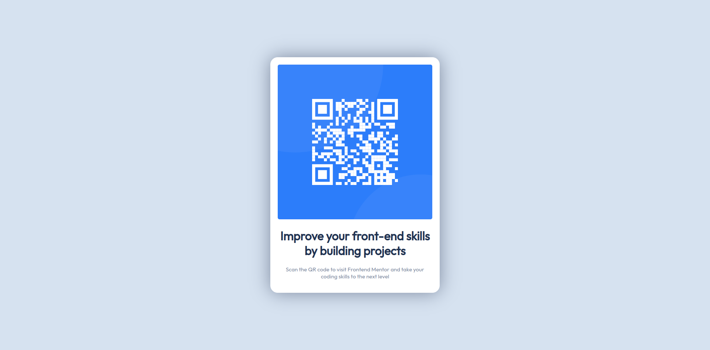

# Frontend Mentor - QR code component solution

This is a solution to the [QR code component challenge on Frontend Mentor](https://www.frontendmentor.io/challenges/qr-code-component-iux_sIO_H).

## Table of contents

- [Overview](#overview)
  - [Screenshot](#screenshot)
  - [Links](#links)
- [My process](#my-process)
  - [Built with](#built-with)
- [Author](#author)

## Overview

### Screenshot

### Links

- Solution URL: [https://github.com/EliusHHimel/qr-code-component](https://github.com/EliusHHimel/qr-code-component)
- Live Site URL: [https://eliushhimel.github.io/qr-code-component](https://eliushhimel.github.io/qr-code-component)

## My process

### Built with

- HTML
- CSS
- Flexbox

## Author

- Website - [EliusHHimel](https://eliushhimel.github.io)
- Frontend Mentor - [@EliusHHimel](https://www.frontendmentor.io/profile/EliusHHimel)
- Twitter - [@EliusHHimel](https://www.twitter.com/EliusHHimel)
- GitHub - [@EliusHHimel](https://www.github.com/EliusHHimel)
- LinkedIn - [@EliusHHimel](https://www.linkedin.com/in/EliusHHimel)
